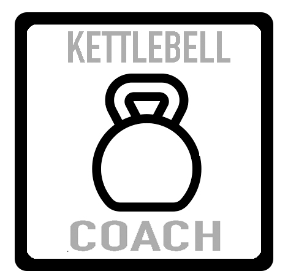

# Kettlebell Coach

### Kettlebell Coach is a progressive web application which gives the user a full kettlebell workout complete with exercises, sets, reps. The app will also track your progress to give you the appropriate exercises for your skill level.

| Exercises     | Sets     | Reps  |
| ------------- |:--------:| -----:|
| KB Swings     | 3        | $1600 |
| Goblet Squat  | 3        |   $12 |
| Bent-Over Row | 3        |    $1 |

### This project is a collaboration between Ed Timmer and Alan Fleming who are both Certified Personal Trainers and Full Stack Developers. 
